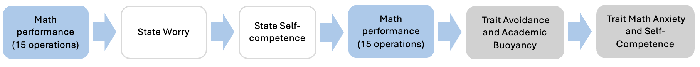
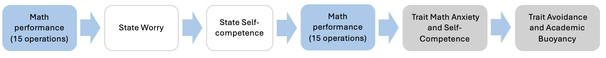
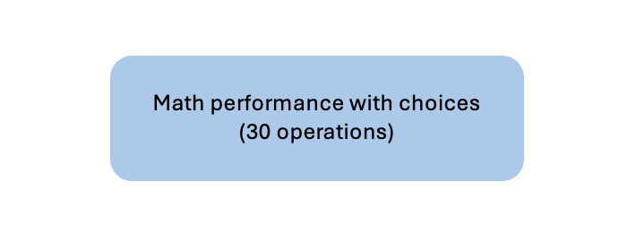

```{r, message=F, warning=F}

```

# Brief description of the experimental design

During both sessions, participants will complete mathematical tasks and, in the first session, also a set of self-report questionnaires assessing emotional factors and attitudes toward mathematics, including both trait measures (i.e., math anxiety, math avoidance, math self-competence, and academic buoyancy), state measures (i.e., worry and math self-competence).
In the first session, participants will complete 15 mathematical operations, followed by the two state questionnaires (worry and math self-competence). After other 15 mathematical operations, participants will be asked to answer to four trait questionnaires (math anxiety, math avoidance, math self-competence, and academic buoyancy). The order of presentations of these questionnaires will be counterbalanced within the participants.

In the second session, participants will complete a set of 30 operations with 3 possible choiches (skip, help and solve indipendently). All tasks will be administered in small groups via computer in the classroom (see Figure 1a, 1b, and 2). 



<br><br>




<br><br>

{width=100mm}


# Research questions and hypotheses

**RQ1:** How can students’ behavioural choices during a mathematical task be conceptualized: as reflecting an underlying ordered continuum (i.e., three progressively increasing levels of the same construct), or as representing three qualitatively distinct behavioural categories?

**HP1:** If the three behaviours reflect an ordered continuum, they should align with increasing levels of task engagement, conceptualized as follows: avoidance indicates a reluctance to engage with the task, help-seeking reflects a willingness to attempt the task but with facilitation, and self-reliance reflects a tendency to solve the task independently. Under this hypothesis, the three behaviours should relate to other relevant variables (i.e., students math attitudes) in a consistent, graded way. If no underlying order is present, students’ choices should instead function as three distinct behavioural categories that differ qualitatively but not along a single gradient. To determine the nature of these behaviours, we will conduct statistical model comparisons (e.g., ordered versus multinomial specifications) to identify which model best fits the data.

**Analysis**: To test whether the dependent variable is categorical, we will use a multinomial logistic regression.
To test whether the dependent variable lies on an ordered continuum, we will also use an ordered logit/probit model with the same predictors of the previous model. 
Model selection will rely on information-criteria (AIC/BIC). Assumptions of ordinal models (e.g., proportional odds) will also be evaluated. If ordered models provide best fit and satisfy proportionality constraints, behavioural choices will be treated as ordinal; otherwise, they will be treated as categorical outcomes.

<br><br>
<br><br>

**RQ2:** Do skipping problems, help-seeking and self-reliance behaviours predict students’ mathematical performance?

**HP2:** 
Once the functional structure of students’ behavioural choices has been established (i.e., ordered or categorical), we will examine how trait ans state attitudes  predict variability in these behaviours. Specifically, higher academic buoyancy and lower avoidance are expected to be associated with more self-reliant choices, whereas higher worry and higher avoidance during the task are expected to relate to increase avoidance behaviours. More help-seeking behaviours are expected to relate with moderate worry and higher buoyancy. These associations are hypothesized to hold after controlling for relevant covariates, including students’ trait math anxiety, trait self-concept, math ability (T0), and gender. Overall, if behavioural choices reflect a graded continuum, predictors should display monotonic effects consistent with the underlying order of engagement; if behaviours represent distinct qualitative categories, predictors should instead differentiate specific behavioural pathways without implying a single ordered direction.

**Analysis**: This hypotesis will be tested using a statistical model chosen on the basis of the conceptualization of the dependent variable (multinomial logistic regression if categorical, logit/probit model if ordered).


